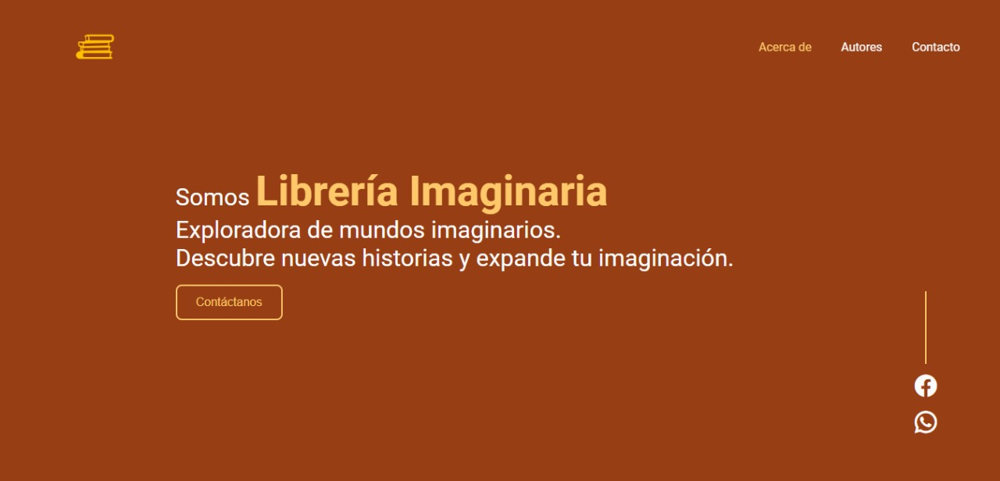
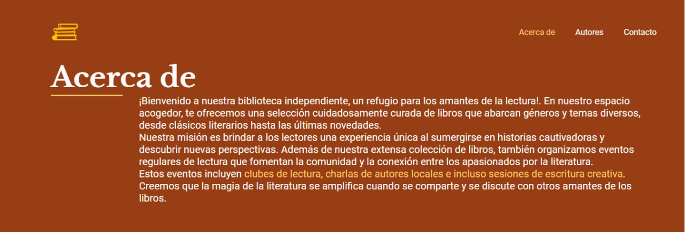

#Librería Imaginaria (Landing pages)

Este proyecto creado para el Instituto Tecnológico de Mérida, es una página web adaptable a dispositivos de distintos tamaños (este tipo de sitio web se conoce en inglés como "responsive"). 

El propósito de esta página web es practicar los conocimientos básicos de HTML creando una página web estática al estilo de una landing page.
Incluye una descripción breve de bienvenida, acerca de, autores, contacto. 

También incluye imágenes alternativas en la carpeta `images` en caso de que se desee personalizar las imágenes principales de nuestros escritores.

### Capturas de pantalla:

Primera parte de la página web:

Acerca de:

Autores:

Contacto:

## Tecnologías

Esta página web fue creada con:

* HTML
* CSS
* JavaScript

Además, se incluyeron **Google Fonts** para personalizar la fuente y **Remix icons** para incorporar íconos como logos de redes sociales populares e iconos de contacto.
